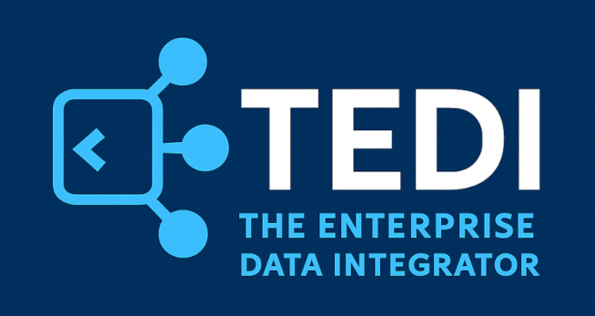

<div align="left">
  <a href="https://github.com/tedi-software/tedi">
    
  </a>
</div>

###### *Copywrite (C) 2020-2025 TEDI, LLC*

[![Contributors][contributors-shield]][contributors-url]
[![Forks][forks-shield]][forks-url]
[![Stargazers][stars-shield]][stars-url]
[![Issues][issues-shield]][issues-url]
[![GitHub Downloads (all assets, all releases)][downloads-shield]][downloads-url]

<p align="left">
<a href="#demo">View Demo</a>
    |
    <a href="https://github.com/tedi-software/tedi/issues/new?labels=bug&template=bug-report---.md">Report Bug</a>
    |
    <a href="https://github.com/tedi-software/rtedi/issues/new?labels=enhancement&template=feature-request---.md">Request Feature</a>
</p>

<a id="top"></a>

### ${\color{949698} ➤}$ About TEDI
<p align="left">
TEDI is an easy-to-use, cloud-native, high-performant, low-code Integration Server. 

Now with **built-in AI Agent Integration** (OpenAI, Groq, and LangChain), TEDI can reason about your data, transform it intelligently, and even automate multi-step workflows — all inside your existing integration pipelines. 
TEDI remains a low-cost solution to facilitate the movement of your important business data between business applications and services (A2A & B2B) internally within your organization and externally with your trading partners.

TEDI saves engineering and development time by employing a framework of common engineering patterns that can be stitched together via workflows driven by configuration files.

TEDI is powered by Golang and can run as a stand-alone binary running in systemd or if you prefer, it can easily be containerized.
</p>
<div align="center">
  <a href="https://github.com/tedi-software/tedi">
    
  </a>
</div>

<p align="right">(<a href="#top">top</a>)</p>

### ${\color{949698} ➤}$ Getting Started
The tedi repository is an example installation. Follow the installation steps below to start and stop TEDI.

#### ${\color{949698} ➤}$ Installation
1. fetch the tedi repository
   ```sh
   git clone https://github.com/tedi-software/tedi.git

   # git clone git@github.com:tedi-software/tedi.git
   ```
2. copy the tedi folder to the directory you want to root TEDI
   ```sh
   cd /path/to/tedi
   cp -pR tedi /opt/
   ```

#### ${\color{949698} ➤}$ Running TEDI
1. start TEDI
   ```sh
   cd /opt/tedi/bin
   ./start.sh
   ```
2. stop TEDI
   ```sh
   cd /opt/tedi/bin
   ./stop.sh
   ```
3. viewing the logs
   ```sh
   cd /opt/tedi/logs
   tail -f tedi_*.log
   ```

> [!NOTE]
> This sample TEDI installation includes binaries for Linux and OSX.

> the MacOSX binaries are not signed and will be put into quarantine on download. To list and subsequently remove from quarantine:
```sh
xattr <binary name>
xattr -d com.apple.quarantine <binary name>
```

<p align="right">(<a href="#top">top</a>)</p>


### ${\color{949698} ➤}$ Usage

##### ${\color{949698} ➤}$ Configuration Files

TEDI uses simple *key-value* property files, like in Java, to configure services. These configuration files support multiline values, comments, environment variable injection, and you can even link to other property files by using the keyword *.include*. By using .include, you can break apart your configurations into smaller, more manageable pieces and is an excellent way of reusing common settings between processors.


view <span style="font-size:0.80em;">``` /tedi/services/archetypes ```</span> for more examples.


##### ${\color{949698} ➤}$ Building an Integration

To build an integration, you will define a *workflow*, a series of *processors* executing in sequence, in a file called <span style="font-size:0.80em;">``` service.properties ```</span>; which is the entry point for all integrations.

A **processor** is an independent module that represents sending or receiving data via a protocol like https, reading/writing records to a database, or interfacing with a message bus (e.g NATS).

At startup, TEDI will scan all the directories under <span style="font-size:0.80em;">``` tedi/services/ ```</span> looking for <span style="font-size:0.80em;">``` service.properties ```</span> files. When it finds one, it will load all the listed services, create a workflow, and begin executing it. This in effect means that in a single TEDI process, you can run a single service (integration), a set of related services, or as many as you like; there's no limit on the number of services you can run. This also means that if you want to prevent an integration from running, you can simply rename the <span style="font-size:0.80em;">``` service.properties ```</span> to something like <span style="font-size:0.80em;">``` ignore_service.properties ```</span>  and TEDI will not load that service.

For some working examples, view <span style="font-size:0.80em;">``` /tedi/services/examples```</span>.


<p align="right">(<a href="#top">top</a>)</p>
<a id="demo"></a>

### ${\color{949698} ➤}$ Demo

Many example services can be found under <span style="font-size:0.80em;">``` /tedi/services/examples ```</span>.

For this simple demo, we'll use the <span style="font-size:0.80em;"> ``` OpenAI ``` </span>  example.

The <span style="font-size:0.80em;">``` cmd ```</span> example demonstrates the stitching together of two *processors* to form a *service interface* or *integration*. 
This particular integration is driven by a shell script, which generates input, and then openai chat agent: 

( these commands assume you rooted tedi under /opt/ )

First follow the installation steps.

```sh
cd /opt/tedi/services/test/ai_transform/openai
mv ignore_service.properties service.properties
cd /opt/tedi/bin
./start.sh
```

This service:
1. Receives a JSON payload from the command processor
2. Passes it to an AI processor (OpenAI/Groq/LangChain) to convert to XML
3. Outputs the AI-generated structured result

Swap in your own prompt and models to adapt it for classification, enrichment, or automated decision-making.

**Note: Model Access Options** 

TEDI lets you run AI processors locally or connect to remote APIs. For each provider, you can choose:
- Local – Run the model on your machine (e.g., via Ollama) to avoid network calls and API costs.
- Remote – Use a hosted model by providing a valid bearer token for API authentication.

Examples:
- OpenAI – Run locally with gpt-oss:20b in Ollama or connect to the OpenAI API using your API key.
- Groq – Run Groq-supported models locally (if available) or connect to Groq’s hosted API with a bearer token.
- LangChain – Chain together local or remote LLMs and tools. For remote use, provide the API key(s) required by your chosen model provider(s).

This flexibility means you can develop and test locally, then deploy with hosted models in production — without changing your workflow definitions.


<p align="right">(<a href="#top">top</a>)</p>


### ${\color{949698} ➤}$ Supported Protocols and Functions
- [x] AI Agent Integration - Combine AI processors with any of TEDI’s existing connectors (SFTP, HTTPS, Databases, etc.) to create pipelines that not only move data, but understand and act on it.
  - [x] OpenAI – Access GPT-class models for summarization, classification, and reasoning
  - [x] Groq – Ultra-fast LLM inference for real-time AI-powered workflows
  - [x] LangChain – Chain models, tools, and APIs for agent-driven automation
- [x] Shell
- [x] SFTP
- [x] HTTPS
- [x] NATS (Core/JetStream)
- [x] XSLT (in-memory/on-disk)
- [x] PGP
- [x] Convert XML <-> JSON
- [x] Convert JSON <-> CSV
- [x] Convert JSONL <-> CSV
- [x] Database
  - [x] Oracle
  - [x] MySQL
  - [x] PostgreSQL
  - [x] Microsoft SQL Server

See the [open issues](https://github.com/tedi-software/tedi/issues) for a full list of proposed features (and known issues).

<p align="right">(<a href="#top">top</a>)</p>


### ${\color{949698} ➤}$ Support
For questions, open an [issue](https://github.com/tedi-software/tedi/issues) 

<p align="right">(<a href="#top">top</a>)</p>


[contributors-shield]: https://img.shields.io/github/contributors/tedi-software/tedi.svg?style=for-the-badge
[contributors-url]:    https://github.com/tedi-software/tedi/graphs/contributors

[downloads-shield]:    https://img.shields.io/github/release/tedi-software/tedi.svg?style=for-the-badge
[downloads-url]:       https://img.shields.io/github/downloads/tedi-software/tedi/total

[forks-shield]:        https://img.shields.io/github/forks/tedi-software/tedi.svg?style=for-the-badge
[forks-url]:           https://github.com/tedi-software/tedi/network/members

[stars-shield]:        https://img.shields.io/github/stars/tedi-software/tedi.svg?style=for-the-badge
[stars-url]:           https://github.com/tedi-software/tedi/stargazers

[issues-shield]:       https://img.shields.io/github/issues/tedi-software/tedi.svg?style=for-the-badge
[issues-url]:          https://github.com/tedi-software/tedi/issues

[license-shield]:      https://img.shields.io/badge/License-Commercial-FF0000
[license-url]:         https://raw.githubusercontent.com/tedi-software/tedi/main/LICENSE
